<div id="inicio">
    <h1 id="titulo" align="center">Problema 3 - MI Sistemas Digitais</h1>
	<p id="descricao" align="justify">Protótipo de um sistema para monitoramento ambiental, incluindo todo o tratamento e controle de sensores analógicos e digitais, bem como uma IHM (Interface Homem-Máquina) para apresentação das informações, incluindo históricos dos dados. O protótipo foi desenvolvido num SBC (Raspberry Pi Zero) que mede temperatura, umidade, pressão atmosférica e luminosidade. A IHM apresenta, em tempo real, as leituras atuais e também permite a visualização do histórico com as 10 últimas medições de cada sensor. 
</P>
<p id="descricao" align="justify">O sistema permite o ajuste local e remoto do intervalo de tempo que serão realizadas as medições. No caso da configuração e do monitoramento remoto, é utilizada uma aplicação (Desktop e Android). A aplicação e o SBC se comunicam através do protocolo MQTT.</p>
</div>

<!--ts-->
   * [Sobre](#Sobre)
   * [Instalação](#instalacao)
      * [APK](#apk)
      * [Desktop](#desktop)
   * [Como usar](#como-usar)
      * [Pre Requisitos](#pre-requisitos)
      * [IHM - Interface Homem Máquina](#ihm)
      * [Aplicativo](#aplicativo)
   * [Testes](#testes)
<!--te-->

## Instalação
```bash
# Clone este repositório
git clone https://github.com/EstherWI/MonitoramentoRaspberry.git
```
<p align="justify"> Geramos duas aplicações para o monitoramento e configuração remota do sistema e disponibilizamos os builds neste repositório.</p>

  - Aplicativo Android
  - Desktop Linux

### APK  
  - Acesse a pasta app do projeto
  - Copie o arquivo app-release-G01.apk para um dispositivo android
  - Abra o arquivo apk e selecione a opção do instalador
  - O aplicativo de nome flutter_application_1 será instalado no dispositivo

### Desktop
  - Acesse a pasta app/desktop-linux-g01/bundle do projeto
  - Abra o arquivo flutter_application_1 que já pode ser utilizado

## Como usar
### Pré Requisitos
#### Ter instalado a aplicação (Android ou Desktop)
#### Transferir arquivos da pasta src para a raspberry:
```bash
scp MonitoramentoRaspberry/src pi@[endereço da raspberry]:[filepath desejado]
```
#### Compilar código na raspberry:
```bash
cd src
make
```
#### Executar código na raspberry:
```bash
./control_rasp
```

### IHM - Interface Homem Máquina 
<p>A IHM compõe os seguintes componentes:</p>
  
  - Raspberry pi zero 
  - Protoboard
  - Chave Dip Switch 4 Vias
  - 3 Chaves Táctil Push Button
  - Display LCD
  - 2 Potenciômetros 
  - Conversor analógico para digital ADS1115
  - Sensor DHT11
  - Resistores

<p align="justify"> 
  Definimos as 3 chaves push button como botões de voltar, próximo e confirmar, respectivamente. Os botões funcionam com a mesma lógica para os três itens do menu. O Display LCD é usado para exibir as informações ao usuário. 
</p>

- Voltar: vai para o item anterior do menu
- Proximo: vai para o próximo item do menu
- Confirmar: exibe o item do menu selecionado

<h3><p><b>Menu:</b></p></h3> 
<h1 align="center">
  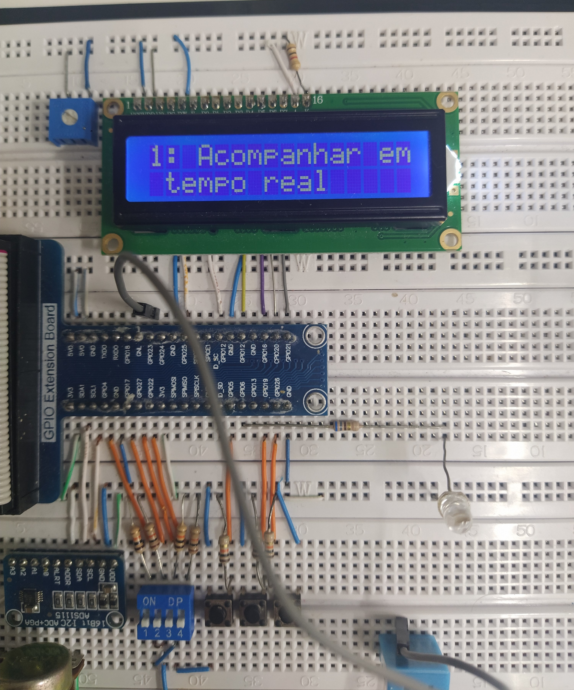
  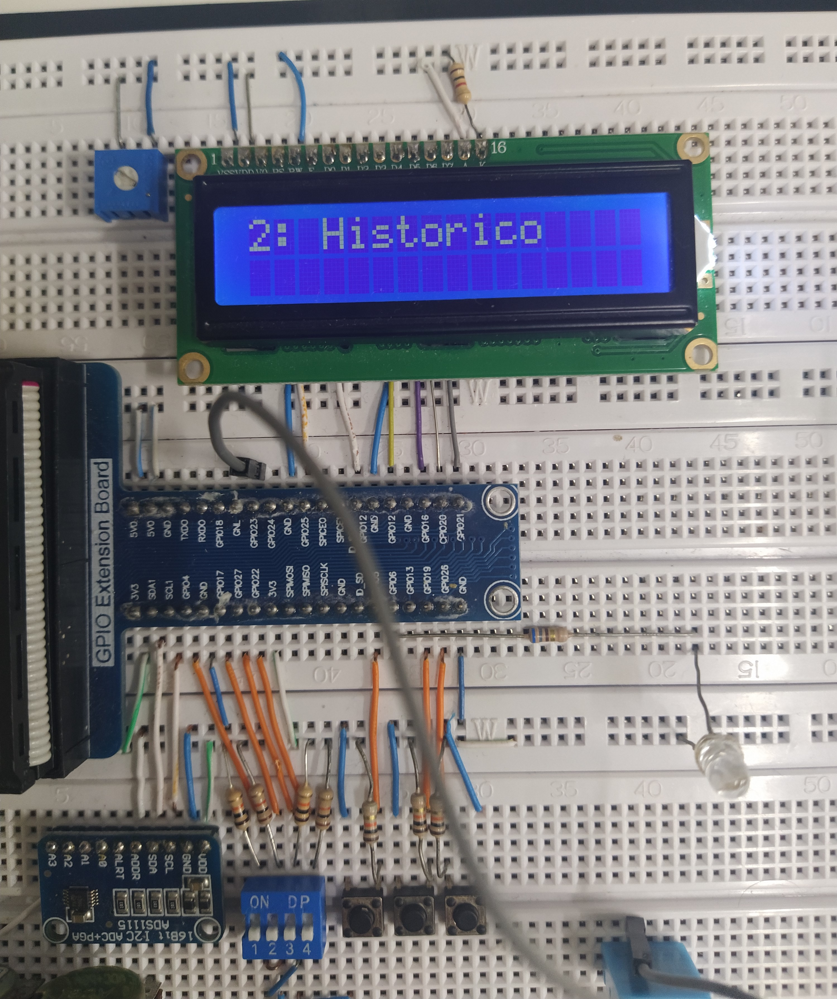
  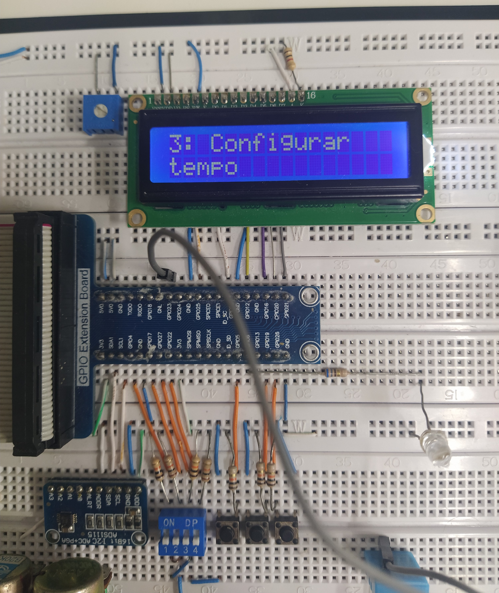
</h1>
 
 

1. Acompanhar em tempo real
    - Exibe as medidas no display LCD:
    <p align="center"> 
      xx.x C | xx.x I <br>
      xx.x U | xx.x Pa
    </p>

2. Historico
    - Exibe as datas das últimas 10 medições, uma por vez, no display LCD.
    - O botão proximo é usado para navegar entre as datas das medições.
    <h1 align="center">
      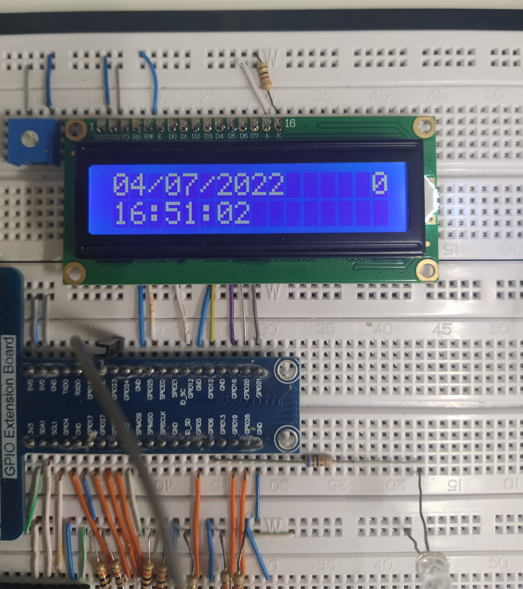
    </h1>

    - O botão confirmar é usado para acessar a medição de uma data e horário específico.
    <h1 align="center">
      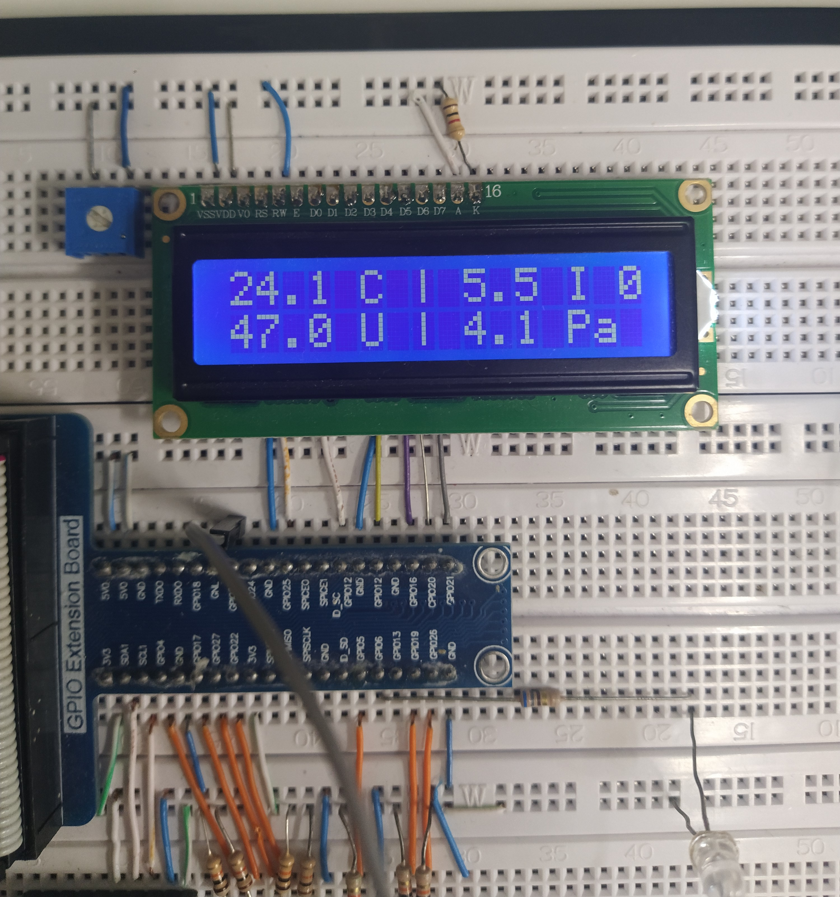
    </h1>

3. Configurar tempo
    - O Dip Switch de 4 Vias é usado para configurar o tempo em segundos com as opções: 40s, 60s, 80s, 100s, para cada chave respectivamente. O tempo default é de 20s. A opção é selecionada quando a chave está em zero (para cima). 
    - O botão de confirmar confirma o valor que a chave representa para o tempo atual.
    <h1 align="center">
      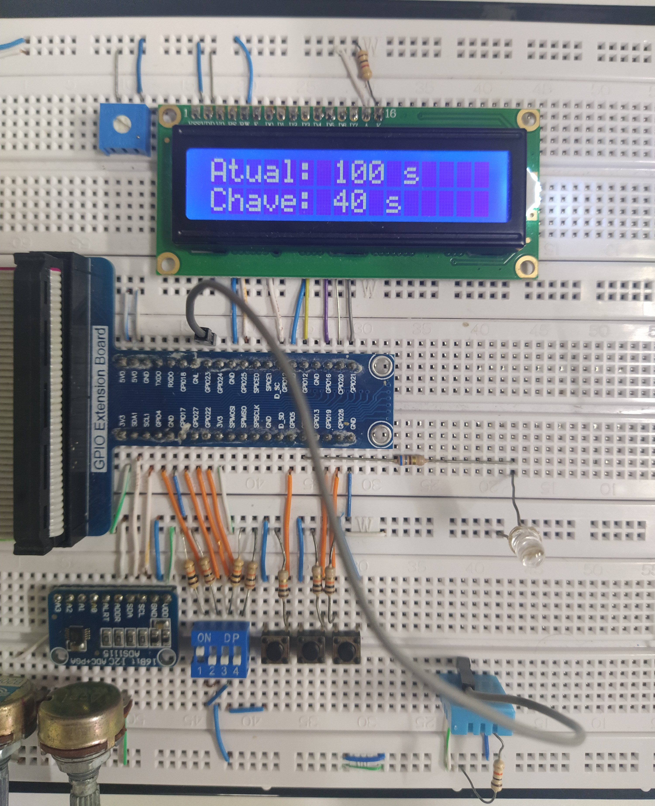
    </h1>

### Aplicativo
<h3><p><b>Interação com usuário:</b></p></h3>
	<p align="justify"> 
       Na Aba de Configurações, é necessário realizar a autenticação com o Broker
    <p> 
<h1 align="center">
  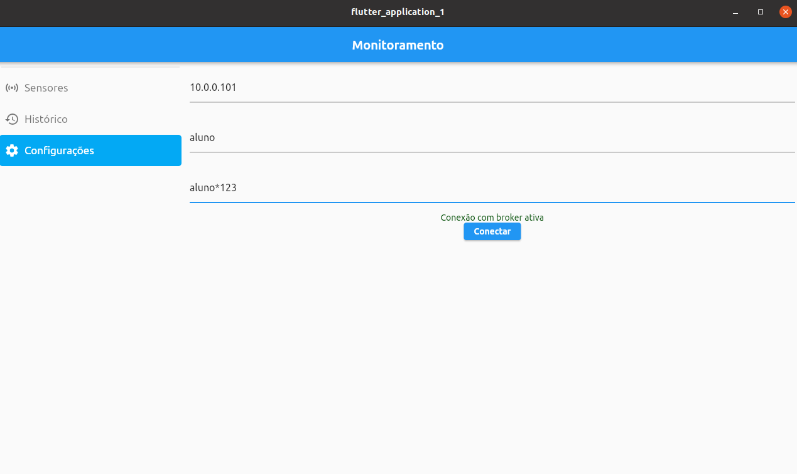
</h1>

<p align="justify"> 
       Dessa forma, será possível monitorar as medições na aba dos Sensores. Nessa página também é possível configurar o tempo de medição.
    <p> 

<h1 align="center">
  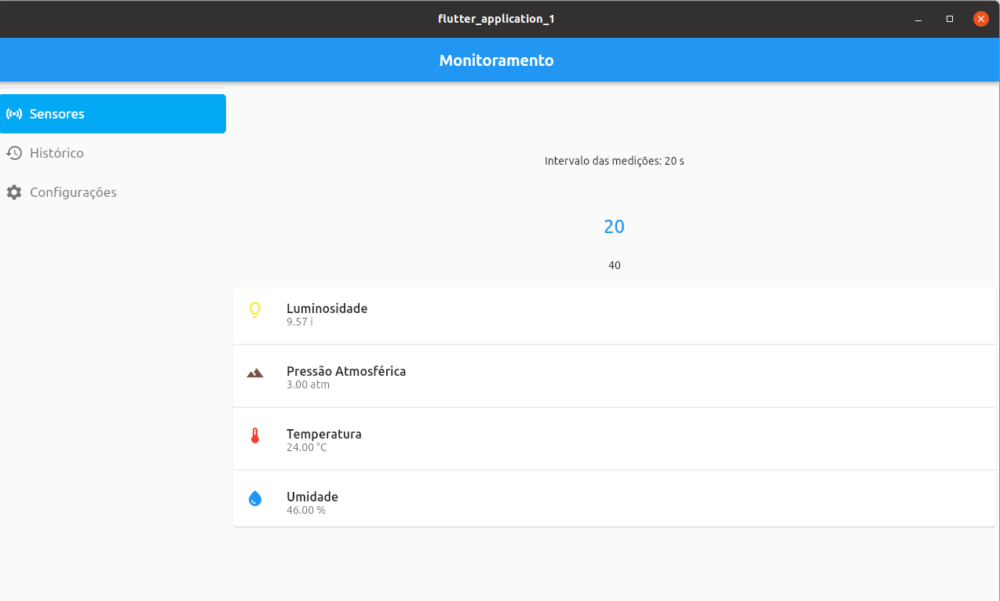
</h1>

<p align="justify"> 
       Navegando na aba Histórico, será possível verificar as últimas 10 medições de cada sensor na tela.
    <p> 

<h1 align="center">
  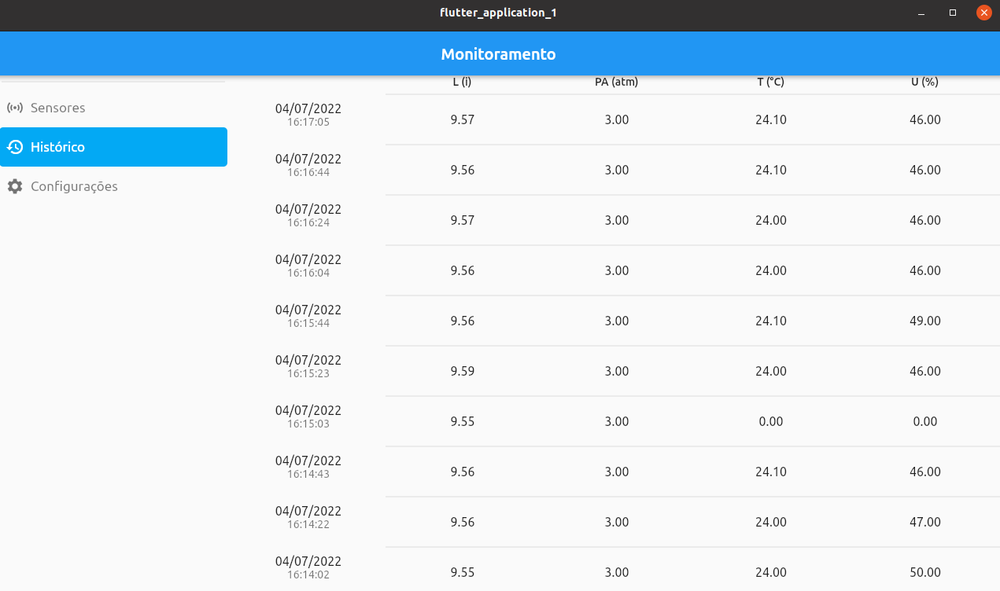
</h1>

### Smartphone
<h1 align="center">
  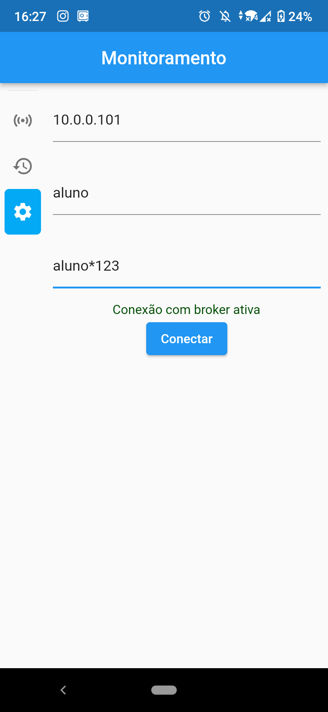
    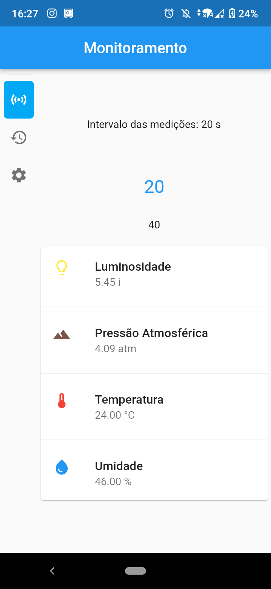
  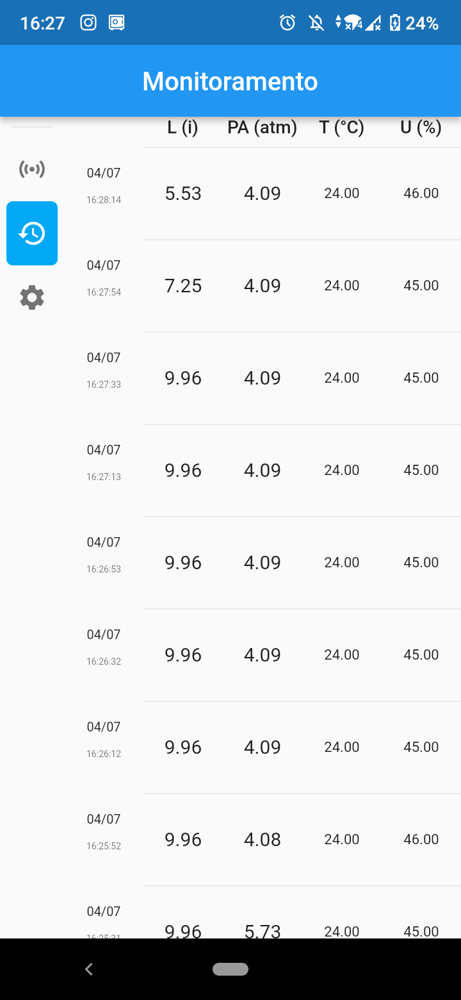

</h1>
 